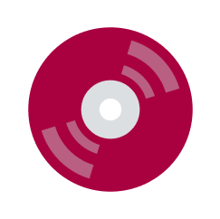
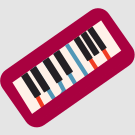
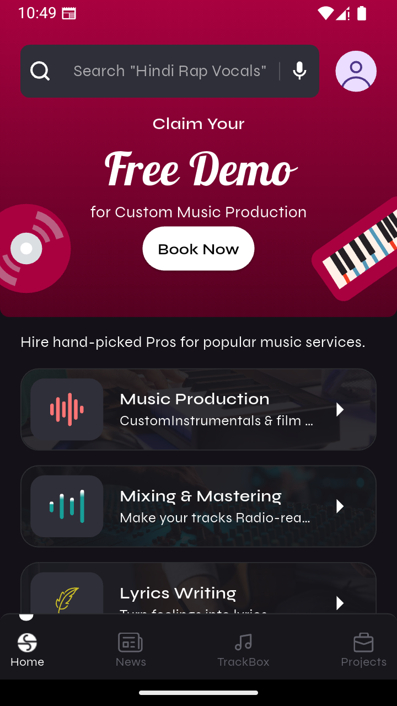
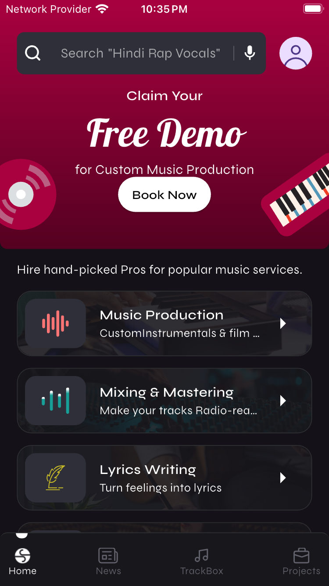
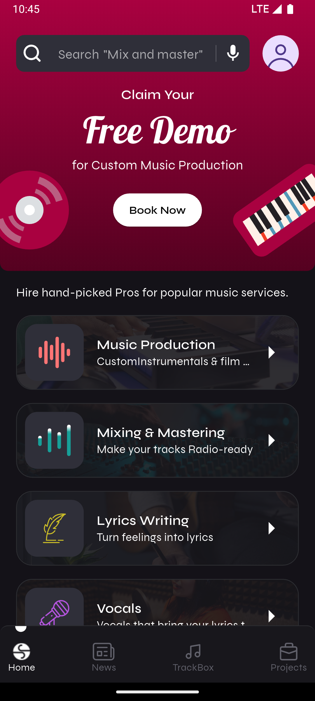

# 🎵 S.Rocks.Music - Flutter Developer Intern Assignment

<p align="center">
  <!-- Logo from assets -->
  
  
</p>

---

## 🌐 Project Overview

<p align="center">
  
  <video width="600" controls>
    <source src="https://github.com/Ahmed-lashari/S.Rocks.Music/blob/main/assets/assignment_overview/assignment_overview.mp4" type="video/mp4">
  </video>
</p>


[proj_overview.mp4](https://github.com/Ahmed-lashari/S.Rocks.Music/blob/main/assets/assignment_overview/assignment_overview.mp4)

---

## ✅ Features

- Recreated Home Screen UI from [Figma Design](https://www.figma.com/design/YAsYsNFGxmoauPpSLrUMtF/Assignment---Flutter?node-id=0-1)
- Tappable cards with title, description, icons, and background
- Firebase Firestore-powered service data (no hardcoded UI content)
- Riverpod-based state management
- MVVM-based clean architecture

---

## 🏗️ Folder Structure

```plaintext
lib/
├── constants/
├── core/
│   ├── config/
│   └── utils.dart
├── data_source/
│   ├── remote/
│   └── repository/
├── models/
├── view/
│   ├── screens/
│   │   └── home/
│   │       ├── home_tab/
│   │       ├── news_tab/
│   │       ├── proejct_tab/
│   │       ├── trachbox_tab/
│   │       └── home.dart
│   ├── themes/
│   ├── ui_config/
│   └── widgets/
├── view_model/
│   ├── action_controllers/
│   ├── data_providers/
│   └── ui_providers/
├── firebase_options.dart
└── main.dart
````

---

## 🧪 Responsive UI Preview (2×2 Grid)

<table>
  <tr>
    <td align="center"><strong>Android Small</strong></td>
    <td align="center"><strong>iPhone SE 3rd Gen</strong></td>
  </tr>
  <tr>
    <td></td>
    <td></td>
  </tr>
  <tr>
    <td align="center"><strong>Android Medium</strong></td>
    <td align="center"><strong>iPhone 16</strong></td>
  </tr>
  <tr>
    <td></td>
    <td></td>
  </tr>
</table>


---

## 🚀 Run Locally

```bash
git clone https://github.com/Ahmed-lashari/S.Rocks.Music.git
cd S.Rocks.Music
flutter pub get
flutter run
```

---

## 🙌 Final Note

This project showcases:

* Real-world UI replication
* Firebase integration
* Scalable folder structure
* Riverpod-driven architecture

---

> **Role:** Flutter Developer Intern
> **Company:** [S.Rocks.Music](https://www.srocksmusic.studio/)
> **Deadline:** 26th May, 2025 – 11:59 PM


